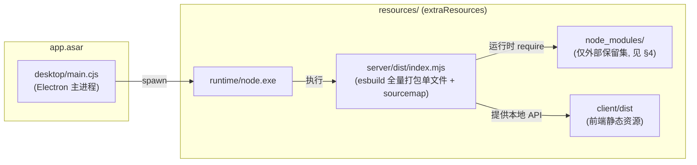

# 运行时依赖打包方案（runtime dependencies）

> 本文档说明 Pi Studio 桌面版的服务端依赖如何打包、哪些依赖必须留在外部、
> 以及升级/新增依赖时如何维护。**改构建流程前请先读这里。**

## 1. 部署架构：两段式

桌面版运行时分成两块：

- **app.asar 内**：Electron 主进程（`desktop/main.cjs`）与前端静态资源。
- **resources/ 外置目录**（`extraResources`）：独立的 Node.js 运行时
  （`resources/runtime/node.exe`，v24.12.0）、服务端单文件
  （`resources/server/dist/index.mjs`）以及少量必须外置的依赖
  （`resources/node_modules`）。



主进程通过 `serverEntry()`（`desktop/main.cjs`）硬编码启动
`resources/server/dist/index.mjs`。**产物文件名不要改**；如确需改名，必须同步改
`desktop/main.cjs`（它在 app.asar 内，electron-builder `files:` 已包含它）。

## 2. 打包策略

服务端用 esbuild **全量打包**成单个 ESM 文件（由 `node scripts/build-server.mjs` 执行，等价参数如下）：

```text
esbuild server/src/index.ts --bundle --platform=node --format=esm
  --alias:pi-mcp-adapter=./node_modules/pi-mcp-adapter/index.ts
  --outfile=server/dist/index.mjs
  --external:@earendil-works/pi-tui
  --external:silk-wasm
  --sourcemap=linked --sources-content
  --define:__PI_VERSION__=<pi-coding-agent 版本>
  --banner:js="import { createRequire as __piCreateRequire } from 'module'; const require = __piCreateRequire(import.meta.url);"
```

- 去掉 `--packages=external` 后，**纯 JS 依赖全部内联**进 `index.mjs`
  （约 26 MB，不再需要把 300+ 个包复制到外部）。
- `--external:@earendil-works/pi-tui`：pi-tui 含原生 `.node` 插件，esbuild 不能内联，
  必须留在外部（见 §4）。
- `--external:silk-wasm`：silk-wasm 是懒加载的 WASM 解码包，显式声明 external 防止
  将来它进入依赖树后被意外内联。
- `--sourcemap=linked --sources-content`：生成 `index.mjs.map` 并内嵌全部源码，
  **仅供开发调试**；发布阶段由构建脚本用 `robocopy /XF *.map` 排除，
  **不随安装包分发**（见 §3）。
- `--define:__PI_VERSION__`：从 `server/package.json` 读取 `pi-coding-agent` 版本并在
  打包时注入，因为 SDK 被内联后运行时读不到它的 package.json（见 §7）。
- `--banner:js=...`：**必须保留**。bundle 是纯 ESM，但被打包的 CJS 模块
  （如 express 依赖链里的 depd）里仍可能有运行时 `require()`（esbuild 转成动态
  `__require`），没有 require 会直接抛
  `Error: Dynamic require of "path" is not supported`。banner 在产物顶部注入
  ESM 版 `require = createRequire(import.meta.url)` 解决。注意 `createRequire`
  **必须用别名**（`__piCreateRequire`），否则会和被打包模块自身的同名导入冲突
  （`Identifier 'createRequire' has already been declared`）。

## 3. 构建链路（scripts/build-runtime-stage.ps1）

```text
npm run build:client  →  npm run build:server（全量打包 + sourcemap）
  →  下载/解压独立 node.exe
  →  npm ci --omit=dev（.desktop-package-stage/runtime-deps，完整安装）
  →  npm rebuild better-sqlite3（为捆绑 Node 重建原生模块）
  →  patch-pi-bundled-deps（修正 Pi SDK 内嵌的 brace-expansion / undici；
      因 pi-coding-agent 已被内联进 bundle，此步通常自动跳过，无害）
  →  keep-runtime-deps.cjs（裁剪 node_modules 到外部保留集，见 §5）
  →  clean-runtime-deps.cjs（删除 *.map / *.d.ts / *.md / 非 win32-x64 原生
      prebuild / test-docs 等惰性文件，见 §5.1）
  →  robocopy（server/dist 用 /XF *.map 排除 sourcemap）→ dist/runtime-stage/Pi Studio/
```

> 顺序很重要：**先完整安装、再裁剪**。keep-runtime-deps 依赖完整的
> node_modules 来计算保留闭包，若先裁剪会导致解析不到包而构建失败。

## 4. 外部保留集（REQUIRED_ROOTS）

以下包**必须**以真实目录形式存在于 `resources/node_modules`。
列表的权威来源是 `scripts/keep-runtime-deps.cjs` 中的 `REQUIRED_ROOTS`，
本文档与其保持一致。

| 包 | 为什么必须外部 | 加载方式 |
|---|---|---|
| `pi-hermes-memory` | 扩展包，运行时按路径加载；依赖含 `better-sqlite3` 原生插件 | `appRequire.resolve()`（bridge.ts） |
| `pi-subagents` | 扩展包，运行时按路径加载 | `appRequire.resolve()`（bridge.ts） |
| `pi-goal-list-loop-audit` | 扩展包，运行时按路径加载 | `resolvePiExtensionEntry()`（bridge.ts） |
| `@earendil-works/pi-tui` | 含原生 `.node`（win32-console-mode），esbuild 无法内联 | 相对路径 + `import.meta.url` 加载原生插件 |
| `@napi-rs/keyring` | 原生凭证存储 | 运行时 `keyringRequire("@napi-rs/keyring")` |
| `@napi-rs/keyring-win32-x64-msvc` | keyring 的 Windows 原生子包 | keyring 内部加载 |
| `@mariozechner/clipboard` | 原生剪贴板 | 运行时 require |
| `@mariozechner/clipboard-win32-x64-msvc` | clipboard 的 Windows 原生子包 | clipboard 内部加载 |
| `recheck` | 正则安全校验，运行时 `require("recheck")` | 运行时 require |
| `recheck-windows-x64` / `recheck-jar` | recheck 的运行时依赖 | recheck 内部加载 |
| `typebox` / `ajv` / `ajv-formats` / `iconv-lite` / `google-auth-library` | MCP 适配器运行时生成的代码引用 | 运行时 require/import |

> 这些 roots 的**依赖闭包**（dependencies + optionalDependencies + peerDependencies）
> 会由 keep-runtime-deps 自动保留，不需要手工列出（例如 `better-sqlite3` 通过
> `pi-hermes-memory` 闭包保留）。实测保留集（clean-runtime-deps 清理后）：
> **90 包 / 2752 文件 / 约 90 MB**（原方案为 315 包 / 267 MB）。

## 5. 裁剪防护（scripts/keep-runtime-deps.cjs）

该脚本在构建时执行，自带三道防护：

1. **roots 存在性校验**：`REQUIRED_ROOTS` 中任一包在 node_modules 解析不到，
   立即以退出码 2 终止构建（避免产出缺包的安装包）。
2. **闭包规模校验**：保留包数低于下限（40）视为算法异常，终止构建。
3. **白名单删除**：只删除不在保留闭包中的顶层条目；scoped 包按子包逐个判断，
   不会误删 `@scope` 下仍需要的包。

输出保留包清单与统计，可在构建日志中核对。

## 5.1 惰性文件清理（scripts/clean-runtime-deps.cjs）

在 keep-runtime-deps 裁剪之后执行，进一步减少安装包内的小文件数与体积。

**删除项**（均对 Windows x64 运行无影响）：
- `*.map`（sourcemap）、`*.d.ts` / `*.d.mts` / `*.d.cts`（类型声明）、
  `*.md`（README / CHANGELOG，保留 LICENSE / COPYING / NOTICE）；
- `test` / `tests` / `benchmark` / `doc` / `docs` / `example` / `examples` /
  `.github` / `.cache` 目录；
- 非 win32-x64 的原生 prebuild（darwin / linux / android / freebsd /
  win32-arm64 / win32-ia32 等 `.node` 及其平台目录）。

**绝不删除**（否则运行时崩溃）：
- `*.ts` / `*.tsx` / `*.mts` / `*.cts`：pi 扩展包（pi-subagents /
  pi-hermes-memory / pi-goal-list-loop-audit）是**从 TypeScript 源码直接加载**的，
  这些 `.ts` 是运行必需文件；
- `*.js` / `*.cjs` / `*.mjs` / `*.json` 及所有 LICENSE / COPYING / NOTICE 文件。

> 该脚本同样作用于 `team-server/node_modules`。

## 6. 升级 / 新增依赖时怎么做

**新增纯 JS 依赖**（无原生代码、无运行时动态加载）：
- 加入 `server/package.json` → 会被 esbuild 自动内联，**无需任何额外操作**。
- 若它体积巨大或需要按需加载，可考虑加入 `--external` 和 `REQUIRED_ROOTS`。

**新增原生模块 / 运行时 require 的模块 / 懒加载模块**：
1. 加入 `server/package.json`；
2. **把它加入 `scripts/keep-runtime-deps.cjs` 的 `REQUIRED_ROOTS`**（否则会被裁剪掉，
   运行时出现 `Cannot find module`）；
3. 同步更新本文档 §4 表格；
4. 重新跑 `npm run build:runtime`，核对日志中保留清单与统计。

**升级依赖版本**：
- 纯 JS 依赖升级 → 直接升级，重新构建即可；
- 原生模块升级（keyring / clipboard / recheck / pi-tui / better-sqlite3）→
  升级后重新构建并**用捆绑的 node.exe 启动一次完整验证**（§8）；
- 升级后若 `npm ci` 报锁文件不一致，先更新 `package-lock.json`。

**升级 Electron / 更换 node.exe 版本**：
- 不影响本方案：bundle 是纯 JS 单文件，原生模块在 `resources/node_modules`
  中用同一 ABI 构建。更换 node.exe 版本后重新 `npm rebuild better-sqlite3` 即可。

## 7. 已知特殊点

- **silk-wasm**：SIP 音频解码包，属于真·懒加载（`Function('return import("silk-wasm")')()`），
  不在依赖树中，缺失**不影响启动**；只有调用该功能时才可能报模块缺失。
- **CJS 动态 require（depd / express 链路）**：纯 ESM bundle 里没有 `require`，
  由 §2 的 `--banner:js` 注入 `createRequire` 垫片解决。若将来新增依赖后再次出现
  `Dynamic require of ... is not supported`，先检查 banner 是否还在
  package.json 的 `build:server` 里，再做针对性处理。
- **pi-coding-agent**：已被内联进 bundle，不再需要外部保留；
  `patch-pi-bundled-deps.cjs` 因找不到其嵌套目录会自动跳过，属正常现象。
- **sourcemap**：`server/dist/index.mjs.map` 仅存在于开发构建产物；发布阶段由
  构建脚本排除（robocopy `/XF *.map`），不再随安装包分发。
- **`ajv/dist/runtime/*`、`ajv-formats`、`google-auth-library`、`iconv-lite`**：
  保留它们是因为代码里有运行时生成的 require 字符串，保险起见留在外部，
  体积开销很小。

## 8. 验证方法

在仓库根目录执行：

```text
node node_modules/esbuild/bin/esbuild server/src/index.ts --bundle --platform=node
  --format=esm --alias:pi-mcp-adapter=./node_modules/pi-mcp-adapter/index.ts
  --outfile=dist/_bundle-test/index.mjs --external:@earendil-works/pi-tui --external:silk-wasm
```

再对产物检查残留的动态加载目标：

```text
node dist/_bundle-test/dyn.cjs      # 列出 bundle 中残留的 require/import 目标
node dist/_bundle-test/probe.cjs    # 抽查关键模块是否被内联
node dist/_bundle-test/native.cjs   # 检查原生模块引用（win32-console-mode 等）
```

完整验证：用 `dist/runtime-stage/Pi Studio/runtime/node.exe` 直接跑
`server/dist/index.mjs`（设置 `PI_STUDIO_*` 环境变量），确认服务能启动、
扩展包（subagents / hermes-memory）能解析、better-sqlite3 能加载。

## 9. 版本记录

| 版本 | 说明 |
|---|---|
| 0.4.19 | 构建标准化：新增 `clean-runtime-deps.cjs` 清理惰性文件/异平台 prebuild（node_modules 3022→2752 文件）；发布产物排除 55MB sourcemap（`robocopy /XF *.map`）；运行时 stage 254→197.7 MB |
| 0.4.13 | 引入本方案：纯 JS 依赖全量打包进 `server/dist/index.mjs`（26 MB），外部 `node_modules` 仅保留原生/懒加载必需集（90 包 / 3022 文件 / 86.5 MB），新增 `keep-runtime-deps.cjs` 裁剪与本文档；修复纯 ESM 下 CJS 动态 require 崩溃（`--banner:js` 注入 `createRequire` 垫片，见 §2/§7） |
| ≤ 0.4.12 | 旧方案：`--packages=external`，外部复制全部生产依赖（315 包 / 267 MB） |